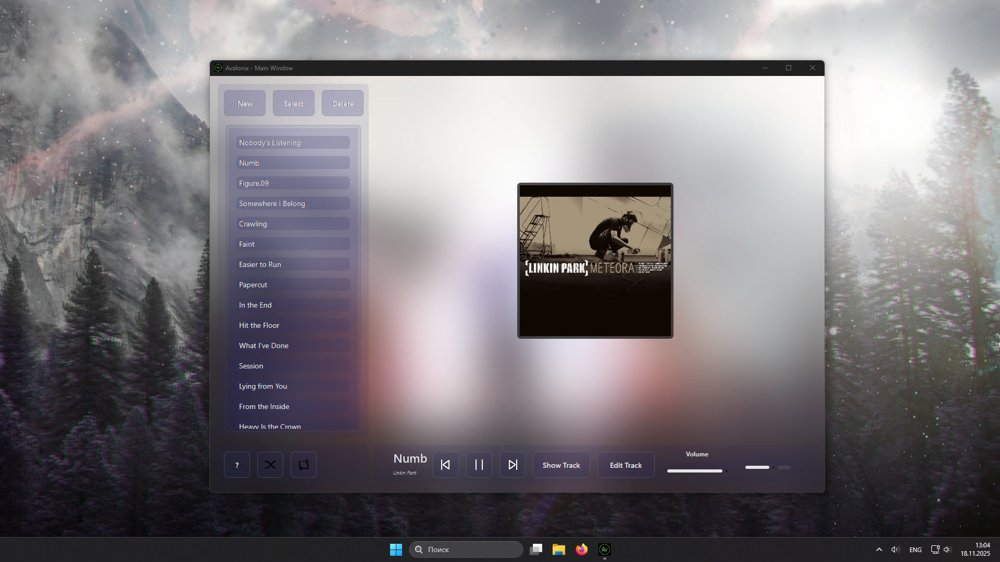

# **Avalonix** 🎵

# 📌 **About**

***Avalonix*** is a ***simple***, ***user-friendly***, ***cross-platform*** playlist player 🎧

# 🌟 **Features**
- 🏗️ **Native**
- 👨‍💻 **User-friendly**
- ✅ **Cross-platform**
- ⚙️ **Working with metadata**

# ⬇️ **Installation**
Method 1:
Download release from our [releases](https://github.com/AvalonixPlayer/Avalonix/releases) page

Method 2:
Clone repo and use **build.bat** file

# 🙏 **Support**
Avalonix is **non-commercial** software. You can help us by **starring** this repository.

# 📚 **Libraries used**
- [AvaloniaUI](https://github.com/AvaloniaUI/Avalonia) - for UI 🖥️
- [NeoSimpleLogger](https://github.com/ruzen42/simple-logger) - for logging 📝
- [taglib-sharp](https://github.com/mono/taglib-sharp) - for parse metadata from audio file 🏷️
- [bass.net](https://www.radio42.com/bass/) - for audio playing 🔊

# 🚀 **Versions system**
**Major. Minor. Patch**

Example: 1.2.5

# 🔧 For Developers

## ⚙️ Dependencies

**BASS.dll** is required for audio processing. Download from [un4seen.com](https://www.un4seen.com/):

- Windows x86 - bass.dll
- Windows x64 - bass64.dll (rename to bass.dll)
- Linux - libbass.so  
- macOS - libbass.dylib

Manual placement **required** - the library must be copied to your application's build output folder.

## 🤝 **Contributing**
***Your contribution*** is ***very important*** to us. Here's how you can help the project:
- 🐛 **Point out the [issues](https://github.com/Nokskiy/Avalonix/issues) you found**
- 🍴 **Make [forks](https://github.com/Nokskiy/Avalonix/forks)**
- 🔀 **Do [pull requests](https://github.com/Nokskiy/Avalonix/pulls)**

# 📄 **License**
[**LGPL-3.0 license**](LICENSE) ⚖️

# ✍️ **Authors**
- [**Ruzen42**](https://github.com/ruzen42) 👨‍💻
- [**Nokskiy**](https://github.com/Nokskiy) 👨‍💻

# 👥 **Contributors**
- [**Contributors**](https://github.com/Nokskiy/Avalonix/graphs/contributors) 🌟
